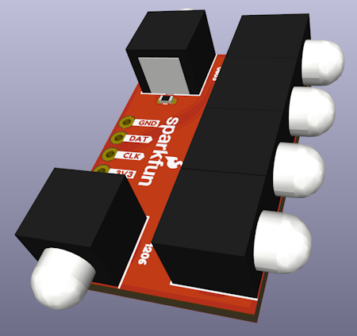

# SparkFun SMD LED Light Pipe

*SparkFun SMD LED Light Pipe rendered above an SMD Addressable LED  - [COM-25893](https://www.sparkfun.com/products/25893)*

The [SparkFun SMD LED Light Pipe](https://www.sparkfun.com/products/25893) is a 5mm plastic lens and housing for mounting SMD LEDs in a 90° board edge configuration. Commonly used for circuit board indicators (CBI). Circuit board indicators should be any color and take only one GPIO to control them all!

This repo houses the 3D files, [datasheet](<SparkFun SMD LED Light Pipe Datasheet.pdf>), as well as an example footprint and layout in KiCad.